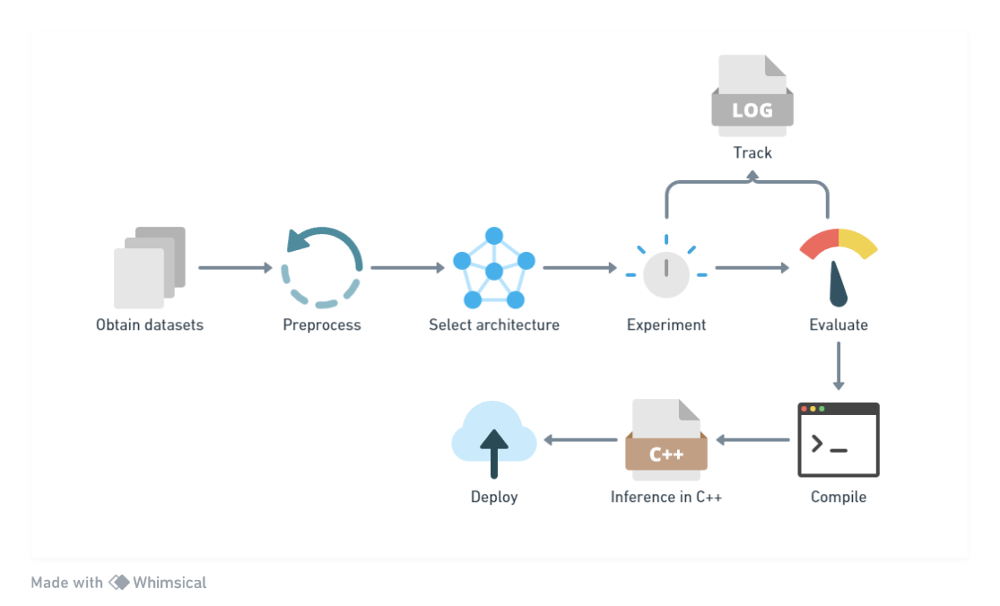

# Neural Machine Translations models from scratch using JAX and SPAX

Building sequence to sequence neural networks from scratch by replication popular research paper using [JAX](https://github.com/google/jax) and [SPAX](https://github.com/svarunid/spax). Spax is neural network library built for simplicity and ease-of-use in mind. 

## Overview
A repository hosting models I build for natural language translation tasks. I aim to learn building an [end-to-endpipeline](#pipeline) of training, evaluating and productionizing deep learning models. I use JAX to implement all the neural network architectures. JAX facilitates ease-of-use, it makes me understand the nuances involved in training a model. I personally am building a tiny neural netowrk library with functional approach. 

## Pipeline

+ Obtaining namchine translation datasets. Starting with small datasets due to restriction of compute resouce.
    - [OPUS](https://opus.nlpl.eu/)
    - [Tatoeba](https://tatoeba.org/en/downloads)
    - [WMT](https://www.wmt-slt.com/)
+ A standard yet simple preprocessing routine performed to ensure the data is normalized
    - Normalize
    - Tokenize (SentencePiece)
+ Implementing popular architectures from scratch.
+ Training and tuning model to find best parameters and tracking the model using [Weights and Biases](https://wandb.ai/)
+ Compiling the model using JAX to [StableHLO](https://github.com/openxla/stablehlo)
+ Build a inferencing module in C++ with the compiled model.
+ Dockerize and deploy the model to the website.

