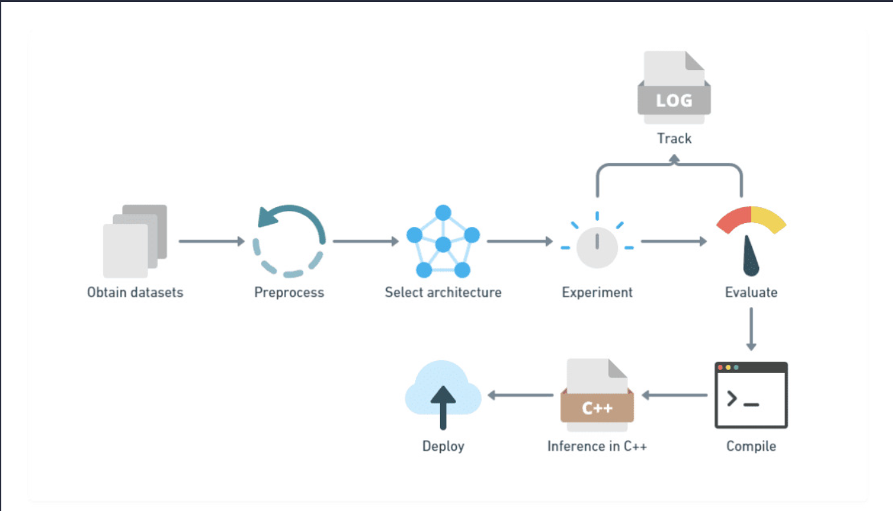

# Text AI (TAI)

A repository hosting deep neural network architectures trained for text based tasks. These include seq2seq, classification, seq2vec, etc.
The model here are built and trained using [JAX](https://github.com/google/jax) and [SPAX](https://github.com/svarunid/spax) which are later compiled to [StableHLO](https://github.com/openxla/stablehlo), a format that can be utilized by [XLA](https://www.tensorflow.org/xla) to run on CPU, GPU and TPU.

---

